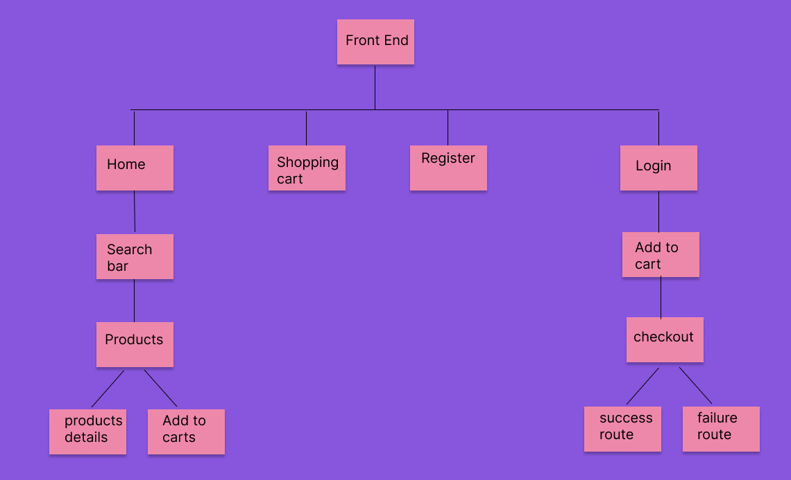
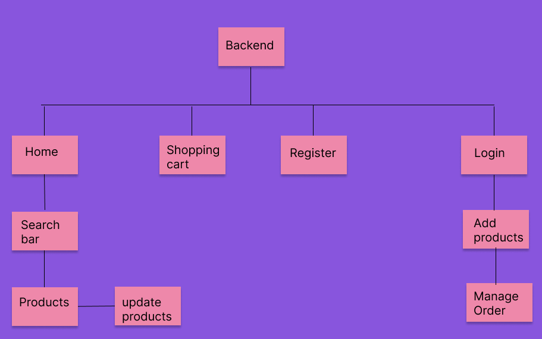
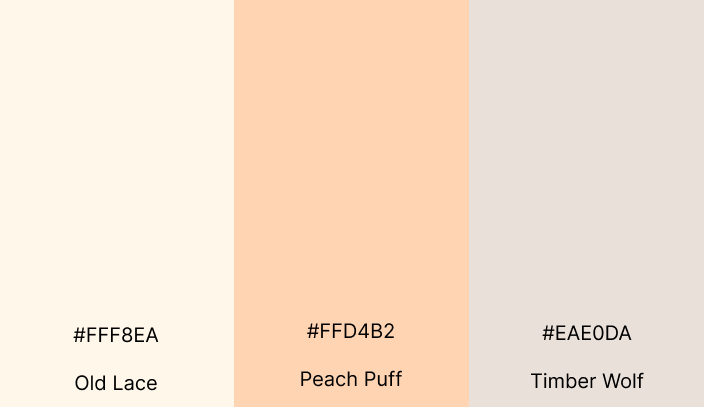

# **Amare l'amore**


Link to demo : [Amare l'amore](https://tgc-amare-lamore.netlify.app/)

### Test Accounts:

- Admin Panel at [Amare l'amore Backend](https://ucjune-project03-db.onrender.com/register)

  - Email: admin@email.com
  - Password: 123456

- React Frontend at [Amare l'amore React](https://tgc-amare-lamore.netlify.app/)
  - Username: customer
  - Password: 123456

---

### Summary

Jewelry can speak to an individual's wealth, social status, culture and reveal more about their self-identity – therefore, people should definitely consider the meaning behind their jewelry choices, as it's another way to allow them to embrace their most authentic self.
Amare l'amore is a e-commerce web application that is designed to consolidate all the jewelry around the world and to provide a fast and pleasant experience for user to search for their special gem.

---

## UI/UX

### Strategy

#### Organisational Goals

To create an e-commerce web application to sell Jewelry exclusively. The organisation aims to serve as a go-to platform where customers can browse and purchase Jewelry based on their needs and preferences.

#### User Goals

| User Stories                                                                | Accceptance Criteria                                 |
| --------------------------------------------------------------------------- | ---------------------------------------------------- |
| As a user, I am always interested with those sparkling gems                 | Jewelry need to be searchable by brand and type      |
| As a user, I would like to compare all the price of all the products        | Jewelries need to be categorised by the various cost |
| As a user , I would like to know the materials that is used for the Jewelry | Jewelries need to be categorised by material type    |

### Structure and Skeleton


The sitemap for Amare L'amore React (e-commerce frontend) is as follow:


The sitemap for Amare L'amore React (e-commerce frontend) is as follow:



### Design Decision

#### Color scheme



Peach puff". It's labeled as "generic pink". Psychologically, when humans think of this color, Peach puff in marketing and promotions, they might associate it with warmth, romance, fun and playful, limiting, and health care.

#### Fonts

_Montserrat_ really shines for short pieces of all caps and the geometric simplicity of the letters.

_Nanum Gothic Coding_ is a contemporary monospaced sans-serif typeface with a warm touch, and it is expertly hinted for screen use.

---

### Backend

| Features                                        | Description                                                                       |
| ----------------------------------------------- | --------------------------------------------------------------------------------- |
| Login, Logout and Registration of admin / staff | Only admin /staff can access the admin panel via their accounts                   |
| Management of products                          | Search for products and perform create, update, and delete operations on products |
| Management of orders                            | Search for orders and perform update operations on orders                         |

## Testing

The website is tested for responsiveness using Developer Tools on Chrome browser for mobile, tablet and desktop screen widths.
The test cases can be found [here](../tgc-project-03/src/assets/screenshoots/Test%20case%20for%20%20Project%203.pdf).

---

## Limitations and Future Implementations

| Limitations                                                    | Future Implementations                                                                       |
| -------------------------------------------------------------- | -------------------------------------------------------------------------------------------- |
| Overall website is lackluster                                  | Consider adding products review and some interesting feature to make the website more lively |
| To improve the aesthetics, UI & UX not really shinning enough. | Learn more from dribble / canva to improve the user 's UI UX experience                      |

---

## Technologies Used

### Backend

| Technology                                                          | Description                                                                                                |
| ------------------------------------------------------------------- | ---------------------------------------------------------------------------------------------------------- |
| [Express](https://expressjs.com/)                                   | Web application framework used                                                                             |
| [Bookshelf.js](https://bookshelfjs.org/index.html)                  | JavaScript ORM used for querying SQL databases                                                             |
| [knex](https://knexjs.org/)                                         | Query builder for PostgreSQL, MySQL, CockroachDB, SQL Server, SQLite3 and Oracle on node.js                |
| [db-migrate](https://db-migrate.readthedocs.io/en/latest/)          | Database migration framework used                                                                          |
| [Axios](https://axios-http.com/docs/intro)                          | HTTP Client                                                                                                |
| [Caolan Forms](https://github.com/caolan/forms)                     | Create and validate forms                                                                                  |
| [CORS](https://www.npmjs.com/package/cors)                          | Middleware to enable Cross-Origin Resource Sharing (CORS)                                                  |
| [csurf](https://www.npmjs.com/package/csurf)                        | CSRF protection middleware                                                                                 |
| [dotenv](https://www.npmjs.com/package/dotenv)                      | To allow loading of environment variables from .env file                                                   |
| [express-session](https://www.npmjs.com/package/express-session)    | Session management middleware                                                                              |
| [connect-flash](https://www.npmjs.com/package/connect-flash)        | Middleware to enable Flash messages                                                                        |
| [express-flash](https://www.npmjs.com/package/express-flash)        | Extension of connect-flash to enable definition and rendering of flash message without redirecting request |
| [JSON Web Token](https://jwt.io/)                                   | Authentication framework with Frontend                                                                     |
| [Handlebars](https://handlebarsjs.com/)                             | Used to generate HTML templates for admin panel                                                            |
| [handlebars-helpers](https://github.com/helpers/handlebars-helpers) | Handlebars helpers                                                                                         |
| [wax-on](https://www.npmjs.com/package/wax-on)                      | Add support to Handlebars for template inheritance with `block` and `extends` helpers                      |
| [Cloudinary](https://cloudinary.com/)                               | Image hosting service used for upload and storage of images                                                |

### Frontend

| Technology                                                                   | Description                                 |
| ---------------------------------------------------------------------------- | ------------------------------------------- |
| [React](https://reactjs.org/)                                                | Frontend framework                          |
| [React Router DOM](https://v5.reactrouter.com/web/guides/quick-start)        | Handle routing in React web application     |
| [Axios](https://axios-http.com/docs/intro)                                   | HTTP Client                                 |
| [React Bootstrap](https://react-bootstrap.github.io/)                        | BootStrap for React application             |
| [React Toastify](https://www.npmjs.com/package/react-toastify/)              | Notification for React application          |
| [Bootstrap](https://getbootstrap.com/docs/5.0/getting-started/introduction/) | Used for styling of web application         |
| [Font Awesome](https://fontawesome.com/)                                     | Used for icons displayed on web application |
| [Stripe](https://stripe.com/en-sg)                                           | Payment gateway used in web application     |

The Express server makes use of the following environment variables:

```
SESSION_SECRET=

DB_DRIVER=
DB_USER=
DB_PASSWORD=
DB_DATABASE=
DB_HOST=

CLOUDINARY_NAME=
CLOUDINARY_API_KEY=
CLOUDINARY_API_SECRET=
CLOUDINARY_UPLOAD_PRESET=

TOKEN_SECRET=
REFRESH_TOKEN_SECRET=

STRIPE_PUBLISHABLE_KEY=
STRIPE_SECRET_KEY=

STRIPE_SUCCESS_URL=
STRIPE_CANCEL_URL=
STRIPE_ENDPOINT_SECRET=
```

---

## Credits and Acknowledgement

### Fonts :

1. [Google Fonts](https://fonts.google.com/) - Used for fonts displayed in website

### Icons :

1. [Font Awesome](https://fontawesome.com/) - Used in tabs and buttons of website

2. [React-Icon](https://react-icons.github.io/react-icons/) - Used for beautiful icons of website

3. [Flaticon]("https://www.flaticon.com/free-icons/") - ewelry icons created by Freepik - Flaticon

4. [Lottiefiles](https://lottiefiles.com/) - Adapted CSS spinner for use in website

5. [Icon](https://www.freeiconspng.com/img/25240) -for icon in success and error page

### Pop up :

1. [React-Tostify](https://fkhadra.github.io/react-toastify/introduction) - Used for beautiful Pop up of website

### Background Image :

1. [Beautiful Png Image](https://www.pngarts.com/explore/104802) - Used for styling the Hero Section
2. [Beautiful image](https://www.pexels.com/photo/ring-in-a-box-1927259/)-Photo by Elina Sazonova

### Other Attributions

1. [Paul Chor](https://github.com/kunxin-chor) tutorial in providing guidance on creating app
2. Wesley and Yong Sheng (Teaching Assistants) for their guidance and support.
3. [SK Jewellery](https://www.skjewellery.com.sg) Beautiful jewellery photo.

## Deployment

The web application is hosted by [Netlify](https://www.netlify.com/)
The Backend of web application is hosted by [Render](https://dashboard.render.com/)

---

## Screenshot

[CreateMockup.com](https://www.createmockup.com/generate/) - Used to generate responsive website mockup for README file
